# Kanesea

Kanesea is a modern and premium full-stack eCommerce platform designed to deliver a seamless online shopping experience with a strong focus on performance, scalability, and elegant UI/UX.

The platform allows users to browse products, search items, manage carts, place orders, and securely complete payments, while administrators can manage products, inventory, and orders through an intuitive dashboard.

---

## Features

### User Features
- JWT Authentication & Authorization
- User Registration & Login
- User Registration & Login with Google
- Add to Cart functionality
- Wishlist support
- Product Search & Filtering
- Detailed Product Pages
- Secure Checkout System
- Secure Guest Checkout System
- Razorpay Payment Integration
- Sell With Us functionality
- Coupons & Discounts
- Email Notifications
- Product Recommendation System
- Fully Responsive Design
- Order Management
- Order Tracking

### Admin Features
- Admin Dashboard
- Add Products
- Edit Products
- Delete Products
- Inventory Management
- Manage Orders
- Manage seller submissions

---

## Tech Stack

### Frontend
- React.js
- Tailwind CSS
- React Router
- Axios

### Backend
- Node.js
- Express.js
- JWT Authentication
- Multer

### Database
- MongoDB

### Payment Gateway
- Razorpay

---

## Installation

### Clone Repository

```bash
git clone https://github.com/sakeenabi03/kanesea.git
```

Move into project folder:

```bash
cd kanesea
```

---

### Backend Setup

```bash
cd backend

npm install
```

Create a `.env` file:

```env
PORT=8000

MONGODB_URL=your_mongodb_connection_string

JWT_SECRET=your_strong_jwt_secret

BCRYPT_SALT_ROUNDS=10

EMAIL=your_email_address

PASS=your_google_app_password

RAZORPAY_KEY_ID=your_razorpay_key_id

RAZORPAY_KEY_SECRET=your_razorpay_key_secret

SHIPROCKET_EMAIL=your_shiprocket_api_email

SHIPROCKET_PASSWORD=your_shiprocket_api_password
```

> Note:
> To send emails using Gmail, enable 2-Factor Authentication and generate a Google App Password instead of using your actual Gmail password.

Run backend:

```bash
npm run dev
```

---

### Frontend Setup

```bash
cd frontend

npm install

```

Create a `.env` file:

```env

VITE_SERVER_URL=http://localhost:8000

VITE_FIREBASE_APIKEY=your_firebase_api_key

VITE_RAZORPAY_KEY_ID=your_razorpay_key_id
```

Run frontend:

```bash
npm run dev
```

---

## Screenshots

### Homepage


### Products Page
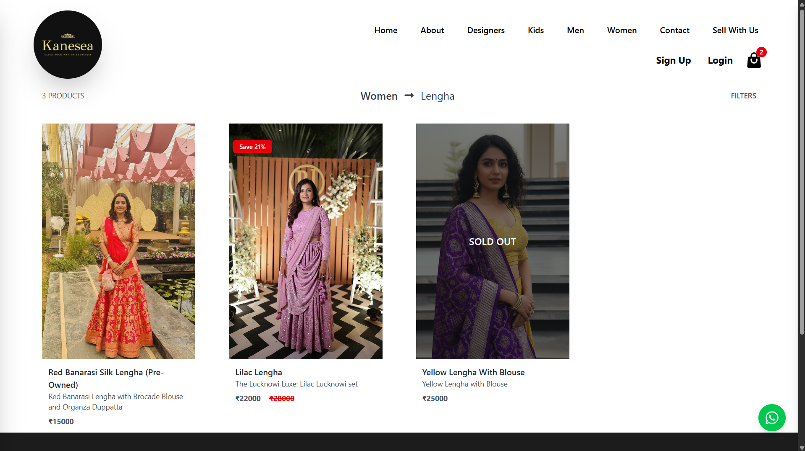

### Product Page
<p align="center">
  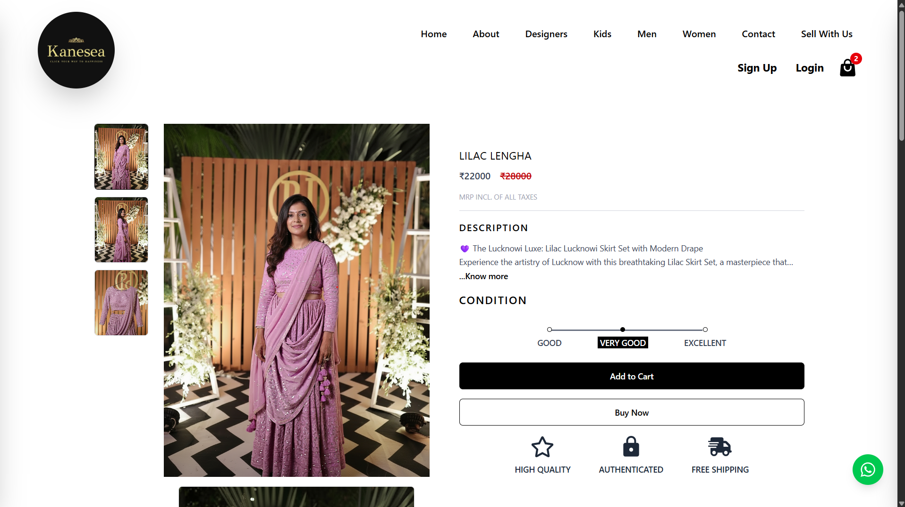
  
</p>

### Cart Page
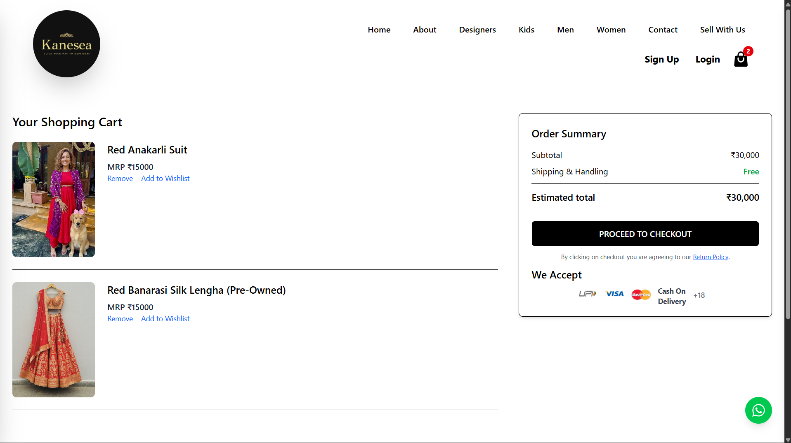

### Checkout Page
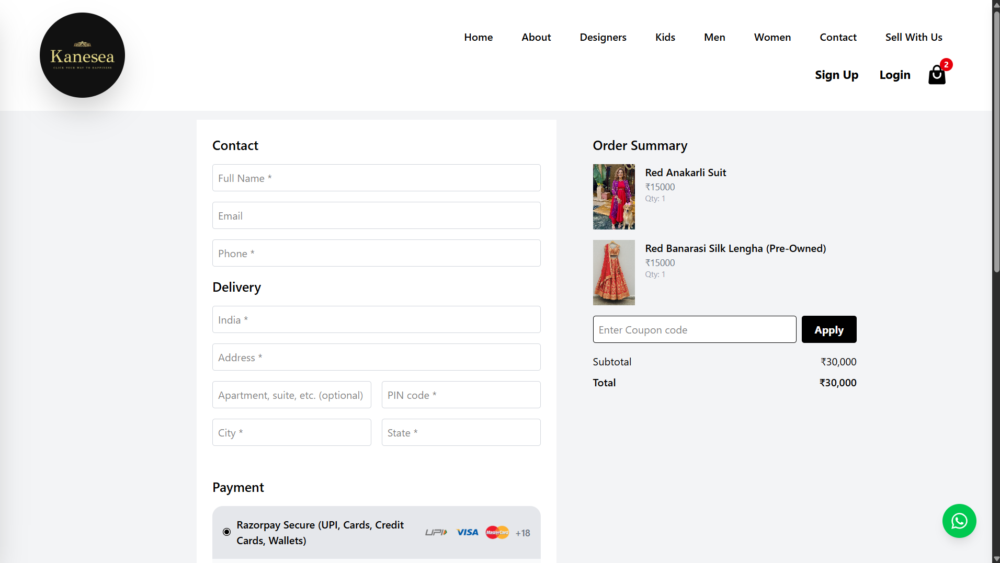

### Checkout Page


### Sell With Us Page
<p align="center">
  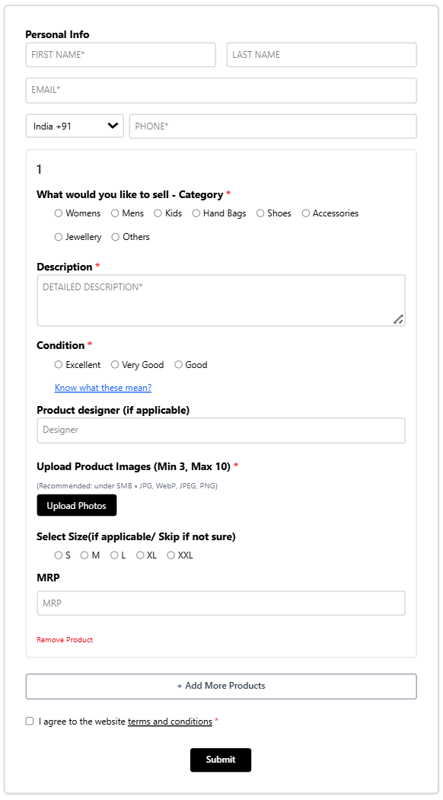
  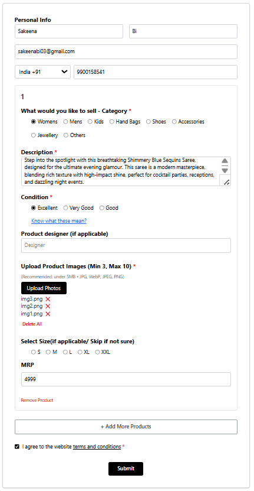
</p>

### Admin Panel
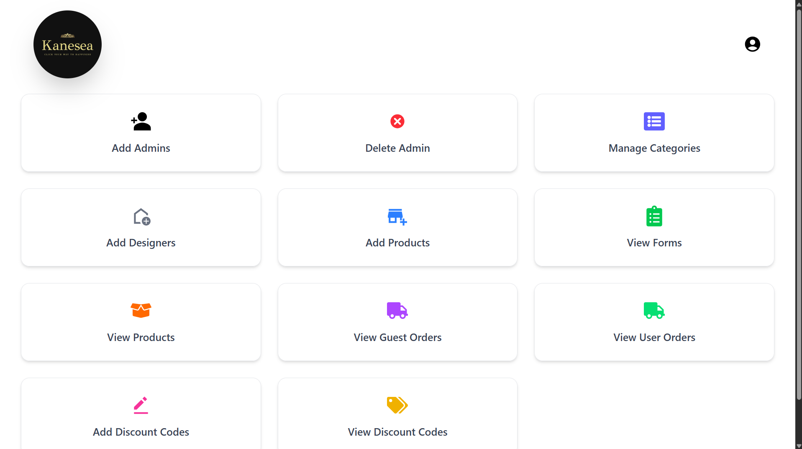

### Add Category Page
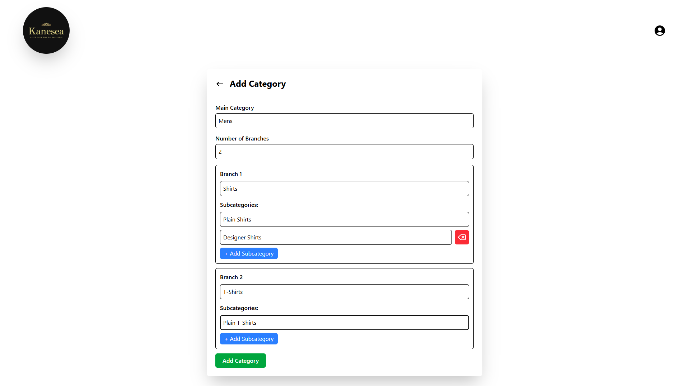

### Add Product Page
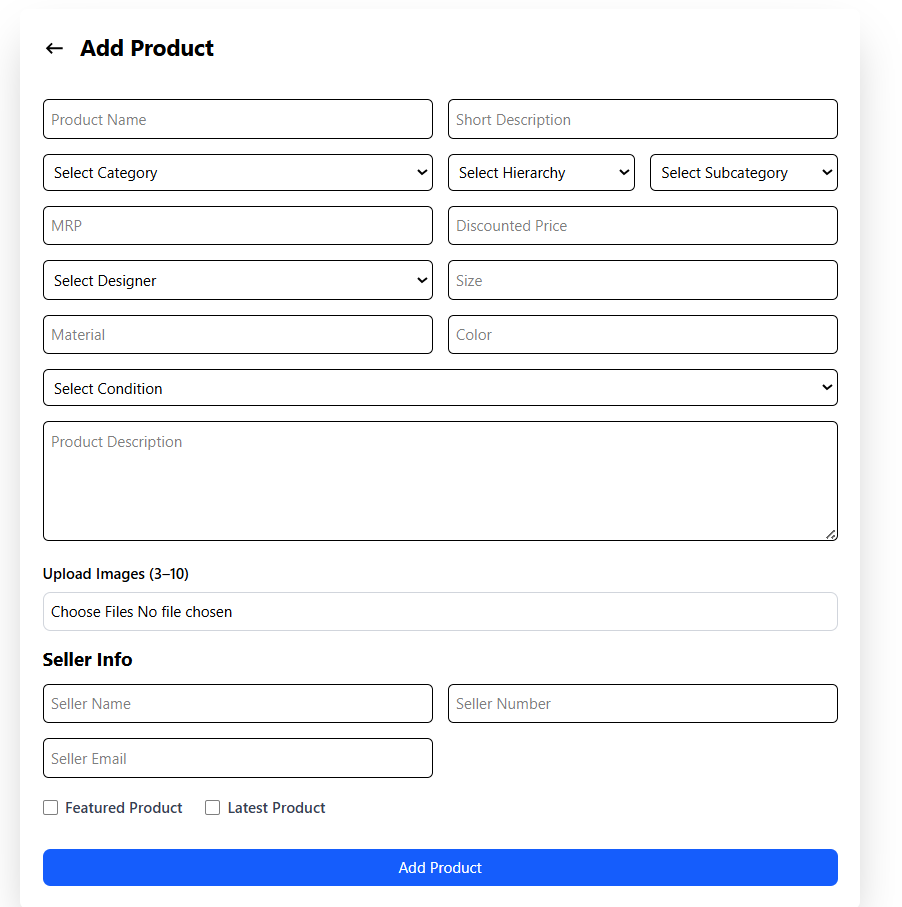

### Add Discout Codes Page
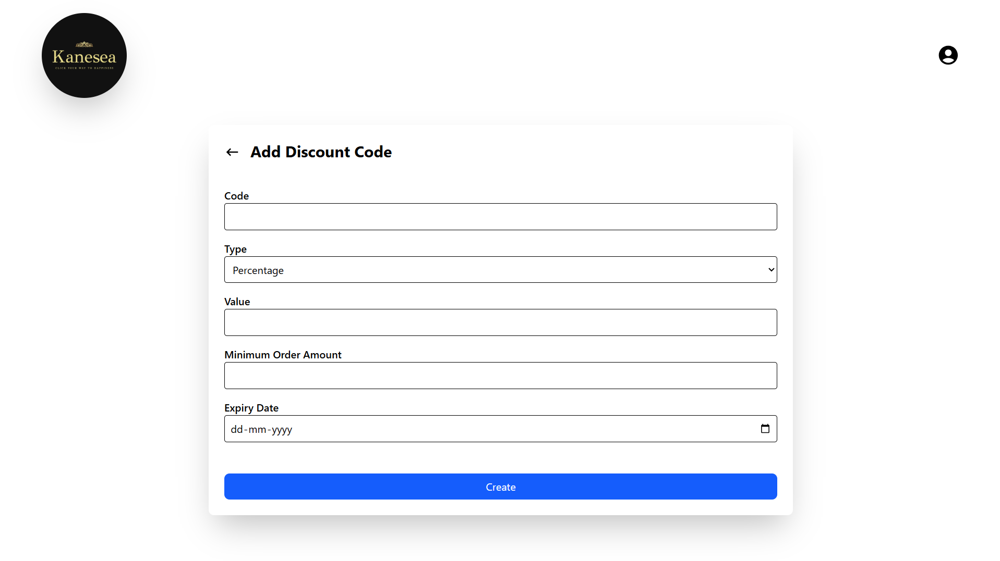

### View Seller Forms
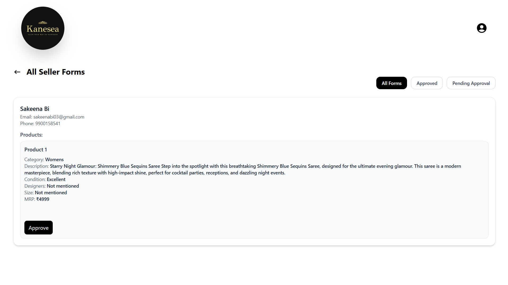

## Author

Sakeena Bi

LinkedIn: https://www.linkedin.com/in/sakeena-bi-2484a7261/

GitHub: https://github.com/sakeenabi03
